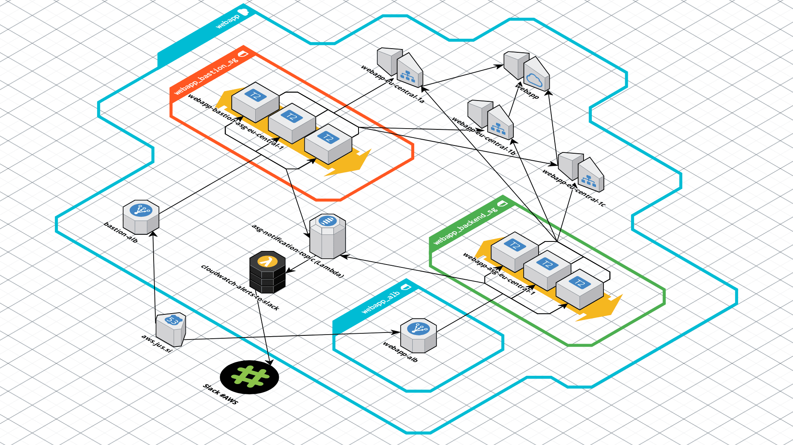

# webapp
HA Webservice on AWS



## Overview
Automated image build and Nginx based web-environment deployment with Ansible, Packer and Terraform.

Technical details:
- Single Ansible Playbook to build and deploy the environment.
- Packer builds custom AMI with temporary Build VPC which is terminated at the end of the build process.
- Dedicated Production VPC with Public and Private subnets spanning 3 Availability Zones.
- ALB handles SSL termination with ACM generated certificate validated through Route53 DNS.
- ALB redirecting traffic from 80 (HTTP) to 443 (HTTPS).
- Bastion and backend instances using AWS Auto Scaling Groups.
- Auto Scaling Group distributes instances to 3 Availability Zones in eu-central-1 (Frankfurt) by default.
- Auto Scaling Group events are subscribed to SNS topic and sent to a Slack channel with Lambda function using the Slack incoming webhooks API:


## Usage
Ansible, Packer and Terraform are required and following environment variables need to be set prior to running ```ansible-playbook deploy.yml```:
```
export AWS_ACCESS_KEY_ID=
export AWS_SECRET_ACCESS_KEY=
```
Also make sure to load your SSH Private Key into ssh-agent:
```
$ eval "$(ssh-agent -s)"
$ ssh-add ~/.ssh/foobar.id_rsa
```
Once finished kill ssh-agent and make sure not to save AWS Keys in .bash_history:
```
$ kill $SSH_AGENT_PID
$ unset HISTFILE && exit
```
As ALB SSL certificate is generated by AWS ACM and validated through Route53 the Route53 Delegated Subdomain needs to be defined in Terraform variables.tf for the environment - this is essential as current implementation relies on ACM providing the certificate through Route53 DNS validation so the deployment is as automated as possible.

### Terraform variables
Terraform variables are defined in file ```variables.tf```.
Following variables need to be changed to suit your environment:

In ```terraform/webapp/variables.tf```:
- key_name
- public_key_path
- route53_zone
- cert_fqdn
- bastion_ssh_from
- slack_webhook_url
- slack_channel
- slack_username

In ```terraform/ami-build/variables.tf```:
- key_name
- public_key_path
- ssh_from

## File structure
```
.
├── ansible
│   ├── default.j2
│   ├── deploy.yml
│   ├── roles
│   │   ├── ami-build
│   │   │   └── tasks
│   │   │       └── main.yml
│   │   └── aws-deploy
│   │       └── tasks
│   │           └── main.yml
│   └── webapp.yml
├── packer
│   └── webapp.json
└── terraform
    ├── ami-build
    │   ├── main.tf
    │   ├── outputs.tf
    │   └── variables.tf
    └── webapp
        ├── main.tf
        └── variables.tf
```

## TODO

- Implement logging to S3 Bucket on various levels (ALB etc.).
- Minor syntax and code cleanup.
- Go through code vs. variables ratio to see if we use too many or too few variables.
